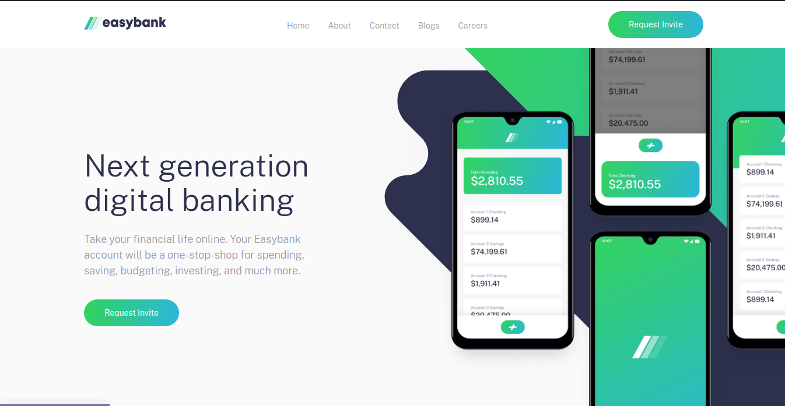

# Frontend Mentor - Easybank landing page solution

This is a solution to the [Easybank landing page challenge on Frontend Mentor](https://www.frontendmentor.io/challenges/easybank-landing-page-WaUhkoDN). Frontend Mentor challenges help you improve your coding skills by building realistic projects.

## Table of contents

-   [Overview](#overview)
    -   [The challenge](#the-challenge)
    -   [Screenshot](#screenshot)
    -   [Links](#links)
-   [My process](#my-process)
    -   [Built with](#built-with)
    -   [What I learned](#what-i-learned)
    -   [Continued development](#continued-development)
    -   [Useful resources](#useful-resources)
-   [Author](#author)
-   [Acknowledgments](#acknowledgments)

## Overview

### The challenge

Users should be able to:

-   View the optimal layout for the site depending on their device's screen size
-   See hover states for all interactive elements on the page

### Screenshot

### Links

-   Solution URL: [https://www.frontendmentor.io/solutions/my-first-complete-landing-page-using-html-sass-and-javascript-lE0zXuXA7](https://www.frontendmentor.io/solutions/my-first-complete-landing-page-using-html-sass-and-javascript-lE0zXuXA7)
-   Live Site URL: [https://ameyadeokule.github.io/easybank-landing/](https://ameyadeokule.github.io/easybank-landing/)

## My process

### Built with

-   Semantic HTML5 markup
-   CSS custom properties
-   Flexbox
-   CSS Grid
-   Mobile-first workflow
-   SASS
-   JavaScript

### What I learned

-   Using BEM naming convention and the reason behind the naming convention, albeit I haven't learned to use it properly.
-   Using SASS to make an entire webpage, this is my first complete SASS project.
-   Use of mixins
-   Understood the method of not scrolling while there is a particulat class active.
-   To add a tint on a webpage and toggling it using the visibility property.
-   Animating the burger menu in the mobile view.

### Continued development

Would like to convert this webpage to a React SPA.

### Useful resources

-   [BEM 101](https://css-tricks.com/bem-101/) - This helped me for understand BEM and its advantages. I really liked this naming principle and will use it going forward.
-   [A Complete Guide to Flexbox](https://css-tricks.com/snippets/css/a-guide-to-flexbox/) - This section helped me in better understanding flexbox and how the arrangements world
-   [A Complete Guide to CSS Media Queries](https://css-tricks.com/a-complete-guide-to-css-media-queries/) - This is an amazing article which helped me finally understand breakpoints and how to handle HTML elements on a much smaller screen using CSS media queries.
-   [CSS Tricks for Grid](https://css-tricks.com/snippets/css/complete-guide-grid/) - Helped to understand CSS grid fragments.
-   [4 reasons your z-index isn’t working (and how to fix it)](https://coder-coder.com/z-index-isnt-working/) - showed to how to fix my overlay non selection problem while providing an overlay.
-   [SASS Tutorial #5 - Mixins](https://www.youtube.com/watch?v=3wXqwX4nu8I) - Showed me exmaples how to create mixins, their advantages and usage.
-   [CSS Overlay Techniques](https://tympanus.net/codrops/2013/11/07/css-overlay-techniques/) - helped to understand methods to add overlay seen in the mobile menu .
-   [Hambuger menu icon animation](https://codepen.io/RRoberts/pen/ZBYaJr) - collection of many types of animations to animate the hamburger menu.

## Author

-   Name - [Ameya Deokule]
-   Frontend Mentor - [@ameyadeokule](https://www.frontendmentor.io/profile/ameyadeokule)

## Acknowledgments

I would like thank Kethmar Salumets [@developerhabits](https://twitter.com/developerHabits) for encouraging me to start completing challenges on Frontend Mentor.
